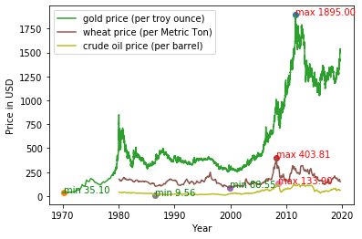

18785-Assignment 2

Name: Junxiao Guo

AndrewID: junxiaog

Date: 2019/09/09

Programming Language: Python

Libraries used: csv, pandas, matplotlib

## Question 1

Using the World Bank Indicators, download data for “GDP per capita (current US$)” and “Malnutrition prevalence, weight for age (% of children under 5).”

What kind of relationship do you expect? Make a scatter plot of malnutrition against GDP per capita (using all available years and countries). What kind of relationship do you see? Make a graph for developing regions (six types and use one color for each). Make a graph for income levels (four types and one color for each). Carefully label all graphs and provide legends.

---

**My Expectation**: The higher GDP per capita countries should have lower malnutrition prevalence level.

  

Fig 1.1 Scatter plot of malnutrition against GDP per capita
 
**Graph Analysis**: Higher GDP per capita countries indeed have lower malnutrition prevalence level.

  

Fig 1.2 developing regions
 

  

Fig 1.3 income levels

## Question 2

Using Quandl, download data, synchronize the time stamps and plot time series for the prices of Wheat, Crude Oil and Gold in $ on the same graph. Indicate the maximum and minimum prices in all three time series using coloured dots. Use a legend to explain each one.

---

  

Fig 2.1 Graph time series for prices of Wheat, Crude Oil and Gold in USD 

## Question 3

Download “CO2 emissions (metric tons per capita)” data from the World Bank Indicators. Select the emissions for all countries in 2010 and calculate summary statistics. Provide a table giving the mean, median, standard deviation, 5, 25, 75, and 95 percentiles. Repeat the same process for “School enrollment, primary (% net).”

---

| Global data for 2010                   | Mean     | Median   | Standard Deviation | 5th Percentile | 25th Percentile | 75th Percentile | 95th Percentile |
| -------------------------------------- | -------- | -------- | ------------------ | -------------- | --------------- | --------------- | --------------- |
| CO2 emissions (metric tons per capita) | 4.847677 | 2.935527 | 5.858565           | 0.118104       | 0.815799        | 6.642697        | 15.670273       |

 Table 3.1 Statistics for CO2 emissions for all countries in 2010
 
| Global data for 2010               | Mean      | Median    | Standard Deviation | 5th Percentile | 25th Percentile | 75th Percentile | 95th Percentile |
| ---------------------------------- | --------- | --------- | ------------------ | -------------- | --------------- | --------------- | --------------- |
| School enrollment, primary (% net) | 89.292969 | 93.042404 | 10.376257          | 69.952073      | 86.622383       | 96.118248       | 99.01914        |

 Table 3.2 Statistics for School enrollment for all countries in 2010

# Question 4
The World Bank Indicators provide variables called “Fertility rate, total (births per woman)” and “GDP per capita (current US$)”.

Make a scatter plot of Fertility rate versus GDP per capita for all countries in 2010. Produce cumulative distribution functions for the fertility rate variable using data from 1990 and 2010 respectively. Use vertical lines to indicate the mean and median. Use a legend to explain which is the mean and which is the median. Have fertility rates changed over this twenty-year period?

---

  

Fig 4.1 Fertility rate versus GDP per capita

## Question 5
Download the latest data for the “Happy Planet Index” from http://www.happyplanetindex.org for year 2016, and “Corruption Perceptions Index” from https://www.transparency.org/news/feature/corruption_perceptions_index_2016. Both datasets are available as excel spreadsheets. Find matching countries for both indices and make a carefully labelled scatter plot to demonstrate the relationship using ranks in both cases. Are there any countries that stand out as being unusual?

---

  

Fig 5.1 relationship between HPI and CPI

