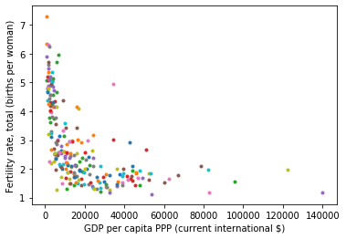
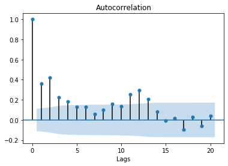
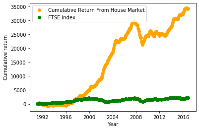

</br></br></br></br></br></br></br></br>
<center>18785-Assignment 3</center></br>
<center>Name: Junxiao Guo</center></br>
<center>AndrewID: junxiaog</center></br>
<center>Date: 2019/09/28</center></br>
<center>Programming Language: Python</center></br>
<center>Libraries used: csv, pandas, matplotlib, scipy</center></br>
<div style="page-break-after: always;"></div>
## Question 1

---

- Mean: 6753.636363636364

- Standard Deviation: 1088.9717646166182

- Standard Error of the Mean: 344.3631083801271

- Degrees of Freedom: 10  

- t-statistic: -2.8207540608310198 

- P Value:0.018137235176105812  

- Since the data comes from a normal distribution, and the mean value is about 6753KJ (which is smaller than 7725KJ), a **left tail test** is appropriate.
- Because the P value is pretty small, the null hypothesis should be rejected.


## Question 2

---

- t-score: 11.647653131319812 
- p-value: 2.315890162874227e-19
- A **two-sample test** is appropriate since  the GOES of Ireland and Elsewhere are independent to each other.
- A right tail is appropriate since the test is about test if the GOES in Irish pub tastes **significantly better** than elsewhere around the global.
- Code for T-stat: See next page

<div style="page-break-after: always;"></div>
```python
class Ireland():
    def __init__(self):
        self.sample_size = 42
        self.mean = 74
        self.std = 7.4
class Elsewhere():
    def __init__(self):
        self.sample_size = 61
        self.mean = 57
        self.std = 7.1
        
ire = Ireland()
elsw = Elsewhere()
t, p = scipy.stats.ttest_ind_from_stats(mean1=ire.mean,mean2=elsw.mean,std1=ire.std,std2=elsw.std,nobs1=ire.sample_size,nobs2=elsw.sample_size,equal_var=False)
### With formula
t2 = (ire.mean-elsw.mean)/(np.sqrt((np.power(ire.std,2)/ire.sample_size)+(np.power(elsw.std,2)/elsw.sample_size)))

assert t == t2 , 't score are not the same!'
print("t-score: {} \np-value: {}".format(t,p))
```

<div style="page-break-after: always;"></div>
## Question 3

<p align="center">
  
</p>
<center>Fig 3.1 Fertility rate versus GDP per capita</center>
- Correlation Coefficient = -0.537393
- Interpolation: The result is showing a **Negative Correlation** which menas the higher rate of fertility somehow leads to lower GDP percapita and vise versa.


<div style="page-break-after: always;"></div>
## Question 4

<p align="center">
  
</p>
<center>Fig 4.1 Time series of the Average House Price</center>
<p align="center">
  
</p>
<center>Fig 4.2 Autocorrelation graph with up to 20 lag</center>
- From the ACF of monthly data, there is indeed evidence of seasonlity according to the autocorrelation with different lags, whereas the graph is somehow representing different P values for differnt time frame wich **can be treated as an evidece for the house house price is relevent sesonality**.
- From the time series, the average house price is generally increasing over time, but with a hugh amount of drop at the year of 2018.
-  Annualized return: 0.057661230215616824

<div style="page-break-after: always;"></div>
## Question 5


<p align="center">
  
</p>
<center>Fig 5.1 cumulative returns from the House market and the FTSE100 index</center>
- Average Anualized Return from the FTSE100 = 0.0498159299296903
- It would be better if **invested housing** at that time