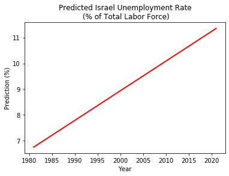

</br></br></br></br></br></br></br></br>

<center>18785-Assignment 4</center></br>
<center>Name: Junxiao Guo</center></br>
<center>AndrewID: junxiaog</center></br>
<center>Date: 2019/09/28</center></br>
<center>Programming Language: Python</center></br>
<center>Libraries used: csv, pandas, matplotlib, scipy, sklearn, RegscorePy, Datetime</center></br>
<div style="page-break-after: always;"></div>

## Question 1: Linear regression with one explanatory variable
---

- **Regression Model Result**:  $$Y = 0.09324143X + 0.00404784$$
- **Correlation Coefficients**: 0.026551295701909897
- **What Does the result tell us**: Since the Correlation Coefficient is very positively small, the result tells us that the FTSE index monthly return does not have a strong relationship between FTSE100 index
- **Hypothesis test to back up**: I used 2 Sample T-test to test the null hypothesis, the result of t-statistics is:
  - statistic=0.011406194343330636
  - p-value=0.9909030401555481
  - With low t-statistic and a p-value above significance for test, the null hypothesis is accepted.


## Question 2: Linear regression with multiple explanatory variables

---

a) Calculate the correlation coefficients of the aforementioned variables.
```
********* Correlation coefficients of the variables *********
               Apps    Enroll  Outstate  Top10perc  Top25perc
Apps       1.000000  0.846822  0.050159   0.338834   0.351640
Enroll     0.846822  1.000000 -0.155477   0.181294   0.226745
Outstate   0.050159 -0.155477  1.000000   0.562331   0.489394
Top10perc  0.338834  0.181294  0.562331   1.000000   0.891995
Top25perc  0.351640  0.226745  0.489394   0.891995   1.000000
```

b) Considering the graduation rate as dependent variable, use stepwise to build the linear regression model

$$Y = 0.0019X['Outstate'] + 0.2255X['Top25perc'] + 33.0860$$

c) Which predictor variables are useful in predicting the graduation rate? Explain how you got those variables.

- By using the P value and cutoff criterion, the useful variables are:

1. Outstate
2. Top25perc

d) Would the set of predictor variables be useful in predicting the graduation rate if you were to use BIC to select the model? Why? 

Since Lower BIC value indicates lower penalty terms hence a better model. From the resulted BIC value:
```
BIC Apps:  4407.711775672192
BIC Enroll:  4424.240873201217
BIC Outstate:  4117.653555107132
BIC Top10perc:  4206.247866576254
BIC Top25perc:  4223.767907533625
BIC 'Top25Perc & Outstate':  4062.6556413233375
```

The set of predictor variables are **still useful** in predicting in graduation rate if were to use BIC to select the model, becuase it has the lowest BIC value comparing to the others

e) Compare the accurate of the model using only useful predictors with the one of the model using all five predictors? 
```
mse_5variables: 180.89546889773055
mse_2variables: 183.37109084792792
```
Use 5 predictors have higher accuracy since it has lower Mean Square Error.

f) Given a set of predictor corresponding to Carnegie Mellon University, what graduation rate value should the most accurate model predict? 

The most accurate model predicts as 69.19326336%


<div style="page-break-after: always;"></div>
## Question 3: Open study

### Data Set

[City of Chicago Speed Camera Violations](https://catalog.data.gov/dataset/speed-camera-violations-997eb) from data.gov (from 2014-07-01 to 2019-09-24 ), the data points I'm choosing are the time records and number of speed violations recored by the camera for every corresponding time.

### My Assumption

The monthly average speed violations decreases along with time.


### Mythology

Algorithm used: Linear Regression

**Procedure**
1. Used data from 2014-07 to 2016-03 as the training dataset
2. Used the trained model to predict the speed violations from 2016-01 to 2019-07

### Conclusions


<p align="center">
  
</p>
<center>Fig 3.1 Trained Model using linear Regression</center>
<p align="center">
  
</p>
<center>Fig 3.2 Test Result by Using Trained Model</center>
The trained model mostly correctly reflected the actual result, though for the time period from January 2019 to July 2019, there is a highly non-linear fluctuation of the speed violations, so fo that part the model didn't reflect the true result accurately

To sum up, my assumption holds true since the trend of monthly average speed violations for the city of Chicago decreased along with time.


<div style="page-break-after: always;"></div>
## Question 4

Predicted Unemployment Rate by year 2020: 11.35775739%

Actual Unemployment Rate by year 2020: 3.9739999999999998%

**Method to evaluate accuracy of the estimate**: Mean absolute percentage error by comparing with the predicted value and actual value.

Mean absolute percentage error  = 127.84262318485848%

<p align="center">
  
</p>
<center>Fig 3.2 Predicted Israel Unemployment Rate</center>